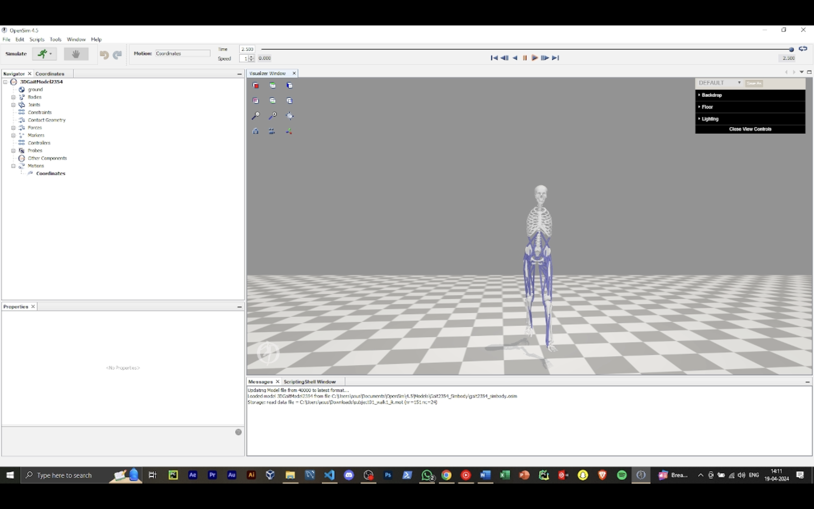
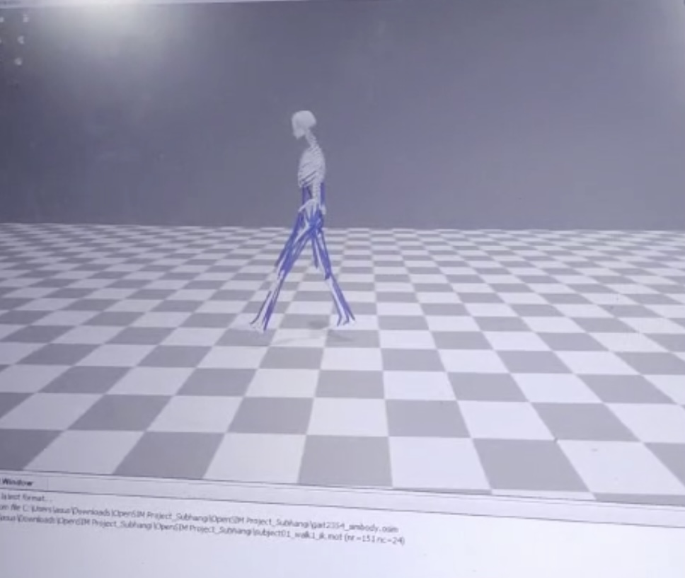

# OpenSim Forward Walk Simulation in Google Colab

This project provides a comprehensive setup and execution environment for running OpenSim simulations in Google Colab. It guides you through the steps to install dependencies, retrieve necessary datasets, and perform biomechanics simulations and inverse kinematics using OpenSim tools. By simulating human gait and biomechanical modeling, you can visualize and analyze kinematic data using Python libraries like Plotly and Pandas.

## Key Features

OpenSim Setup in Colab: 
- Installs OpenSim libraries in a Google Colab environment using Conda, enabling the simulation of musculoskeletal models.
- Data Preprocessing and Plotting: Utilizes Python libraries like Pandas and Plotly to process and visualize time-series data from the walking simulations.
- Inverse Kinematics: Executes inverse kinematics on pre-defined human gait models to analyze joint angles such as ankle, knee, and hip flexion during walking.
- Integration with OpenSim Models: Clones repositories containing OpenSim models for human gait and loads the necessary files for further simulation and analysis.
- 3D Biomechanics Data: Implements the processing of 3D biomechanics data, enabling visualization of human motion from C3D files.


## Table of Contents

- [Installation](#installation)
- [Dependencies](#dependencies)


## Installation

You're just a few steps away from running amazing simulations!

### Step 1: Install Conda and OpenSim

To work with OpenSim in Google Colab, install `condacolab` and `OpenSim` via conda:

```python
!pip install -q condacolab
import condacolab
condacolab.install()
!conda install -c opensim-org opensim
```

### Step 2: Install necessary libraries
Install required Python libraries like plotly, pandas, tensorflow, and other dependencies.

```bash
!pip install -q plotly pandas pyvirtualdisplay c3d svgutils
!apt-get install -y x11-apps mesa-utils xvfb x11-utils
```

##Dependencies

Google Colab
Python 3.x
Conda
OpenSim
Plotly
Pandas
TensorFlow
PyVirtualDisplay
C3D
OpenSim models (GitHub repos)


##Output Demo Screenshots


